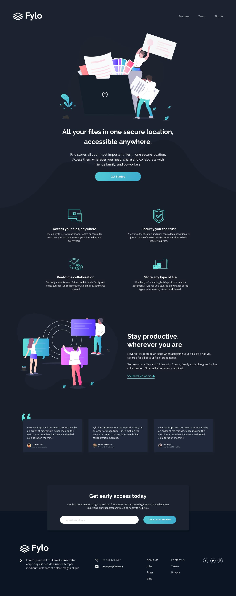

# Frontend Mentor - Fylo dark theme landing page solution
[](https://app.netlify.com/sites/sidehustle-capstone-fylo/deploys)
This is a solution to the Sidehustle Internship v.5 Capstone challenge. Sidehustle Internship challenges help you improve your coding skills by building realistic projects. 

## Table of contents

  - [The challenge](#the-challenge)
  - [Screenshot](#screenshot)
  - [link](#link)
  - [Built with](#built-with)
  - [What I learned](#what-i-learned)
  - [Author](#author)
  - [Acknowledgments](#acknowledgments)

### The challenge

Users should be able to:

- View the optimal layout for the site depending on their device's screen size
- See hover states for all interactive elements on the page

### Screenshot




## link
- 

### Built with

- Semantic HTML5 markup
- CSS custom properties
- Flexbox
- CSS Grid

### What I learned

how to use CSS Grid and Flexbox

To see how you can add code snippets, see below:

```html
<h1>Some HTML code I'm proud of</h1>
```
```css
.proud-of-this-css {
  color: papayawhip;
}
```


If you want more help with writing markdown, we'd recommend checking out [The Markdown Guide](https://www.markdownguide.org/) to learn more.


## Author
- LinkedIn - [@josephjohn](https://www.linkedin.com/in/joseph-john-b1bbb4226)
- Twitter - [@JosephJBassey](https://www.twitter.com/JosephJBassey)


## Acknowledgments
- Chaoocharles - [@chaoocharles](https://github.com/chaoocharles)
- Vanzasetia - [@vanzasetia](https://github.com/vanzasetia)
